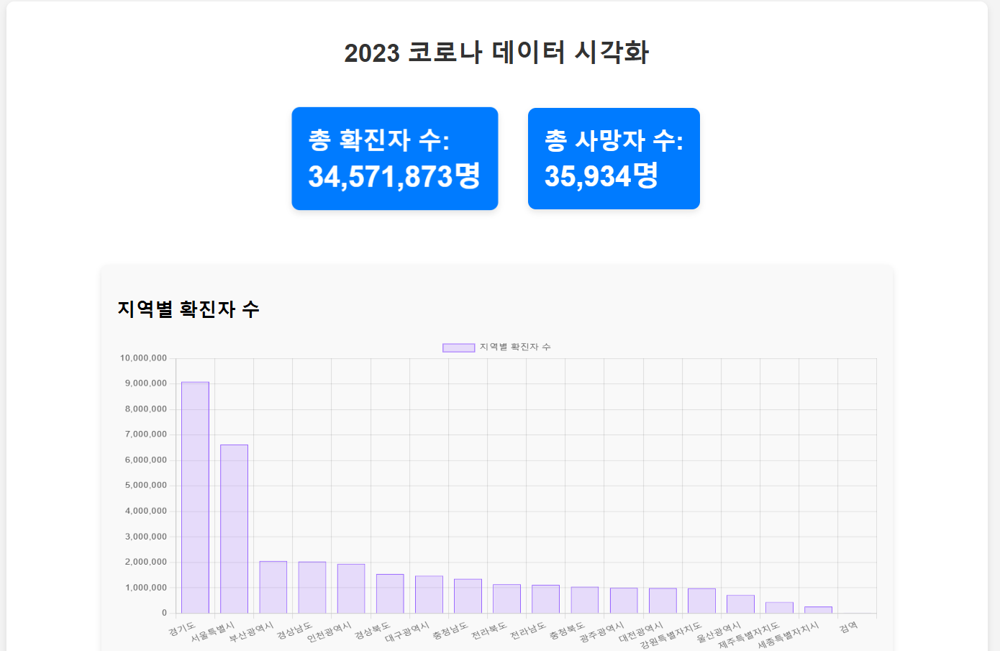
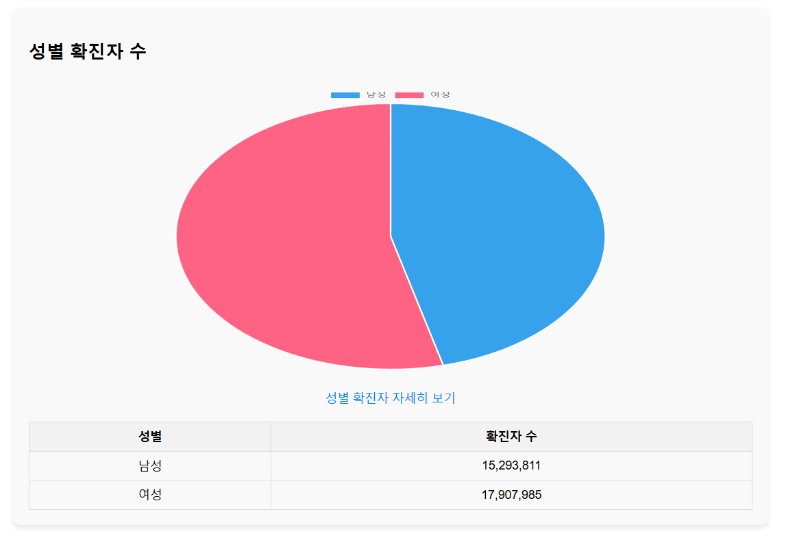
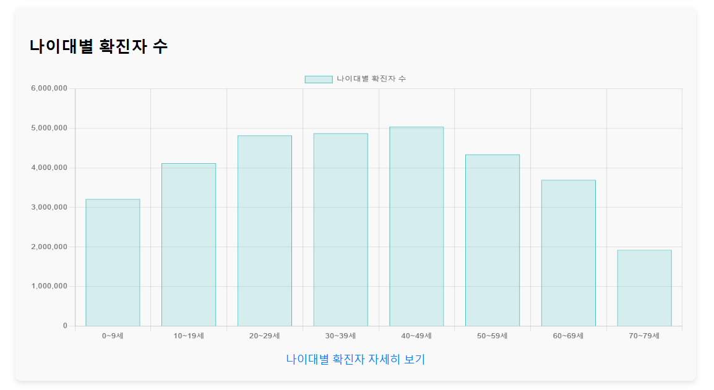
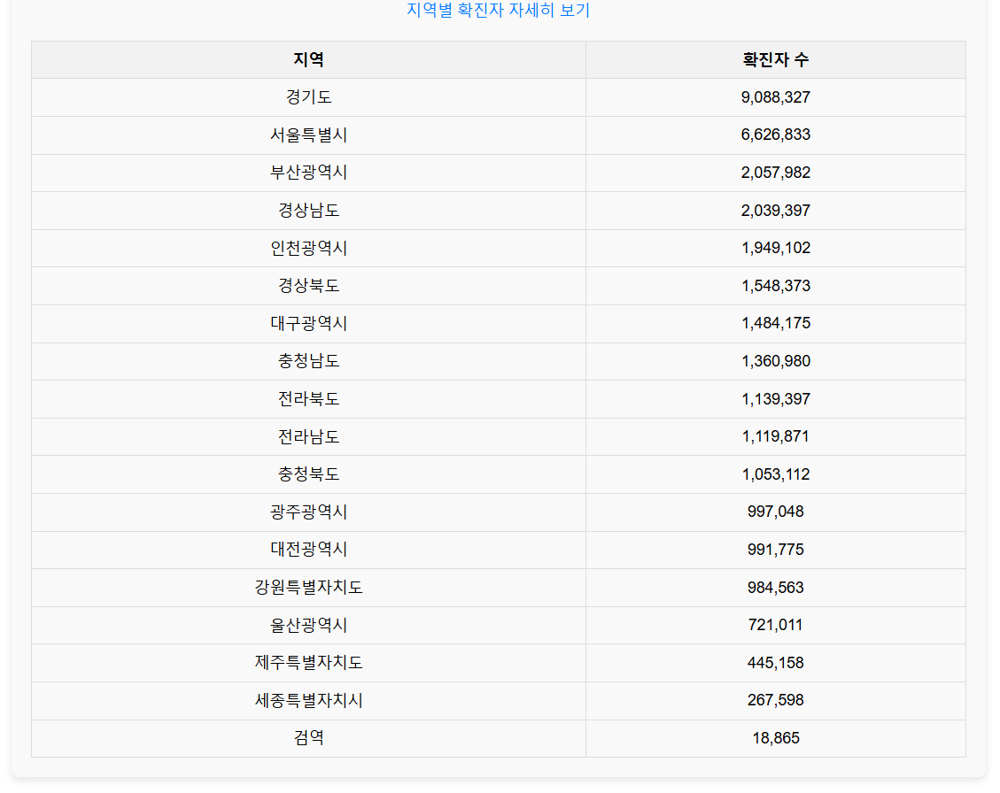
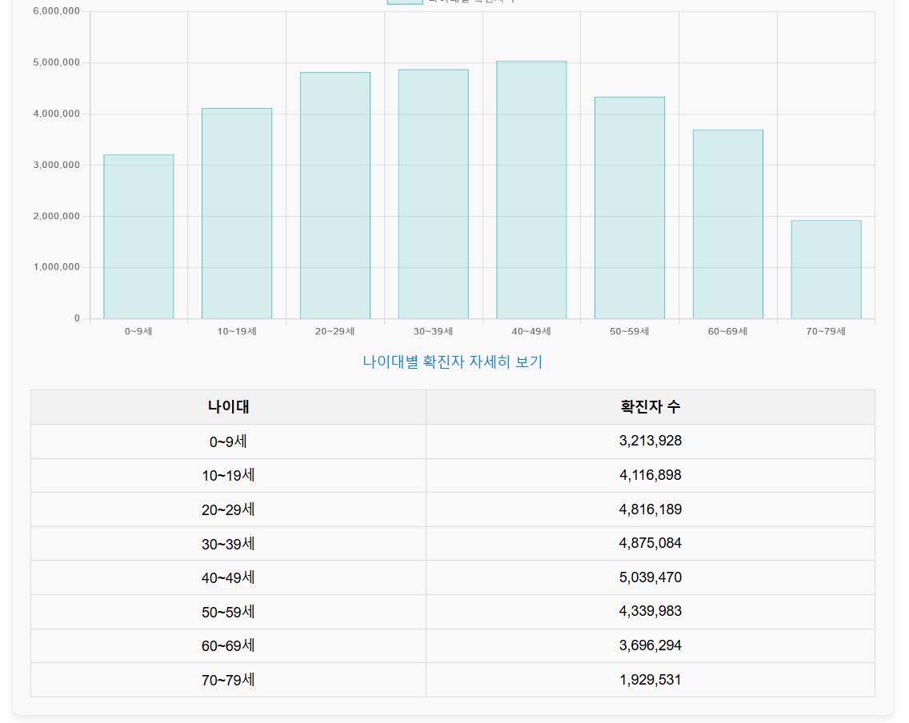

# 🦠 Corona Visualizer
> Java 기반으로 구축한 코로나 데이터 실시간 크롤링 및 시각화 웹 프로젝트

## 📌 개요
- 한국전파진흥협회 '지능형 웹 알고리즘을 활용한 풀스택 개발자 과정'을 기반으로 한 실전형 프로젝트
- Jsoup을 활용한 코로나 확진자 데이터 크롤링
- Spring Boot 기반 API 서버 구축
- Chart.js + Thymeleaf로 웹 시각화 구현

## 💡 주요 기능
- 지역별, 성별, 나이대별 코로나 확진자 실시간 통계 제공
- 웹 기반 차트로 직관적인 데이터 확인 가능
- 정형 데이터 수집 → 분석 → 시각화 전체 구현


👉 [Corona Visualizer 시연 영상 보러 가기](https://youtu.be/51z6Or3i0Ug)

[](https://youtu.be/51z6Or3i0Ug)


## 🛠 사용 기술
- Java 17 / Spring Boot
- Jsoup / Chart.js / Thymeleaf / HTML+CSS
- Git / GitHub / Maven

## 📸 화면 예시
> 지역별 / 성별 / 나이대별 코로나 확진자 차트  
(스크린샷 2~3장 첨부)

## 📁 프로젝트 구조
```bash
corona-visualizer/
├── src/
│   ├── main/
│   │   ├── java/com/corona/corona_visualizer/
│   │   │   ├── controller/
│   │   │   ├── crawler/
│   │   │   ├── model/
│   │   │   └── service/
│   │   └── resources/
│   │       ├── templates/ (index.html)
│   │       └── static/css/
├── pom.xml
└── README.md
```

## 📸 화면 예시

### 🗺️ 지역별 확진자 시각화


### 🧍 성별 확진자 시각화


### 📊 연령대별 확진자 시각화


### 📋 데이터 테이블 예시




> 많이 허술하지만, 본 프로젝트는 교육 과정 중 배운 기술을 실전 문제에 적용하고, 데이터 기반 사고와 풀스택 구현 능력을 검증하는 데 중점을 두었습니다.
